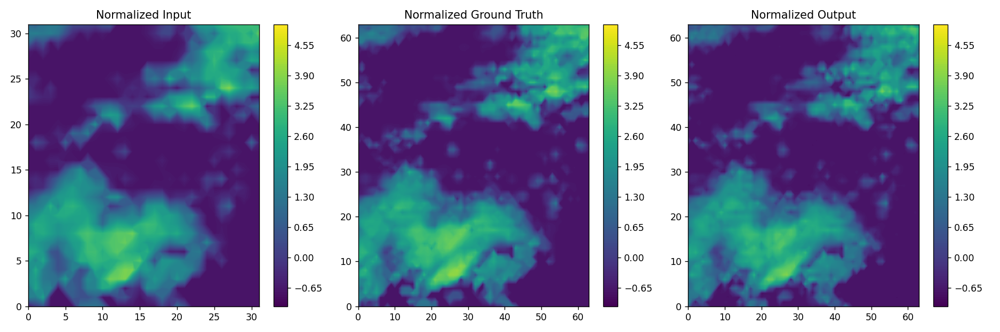

# Meteor-SR
A basic implement of SR3 and EDSR for meteorlogical graph super-resolution

## Technique
- Basic DDPM, DDIM, Sigmoid schedule
- Basic EDSR
- Warmup and cosine lr-scheduler
- Preprocess scripts without data augmentation

